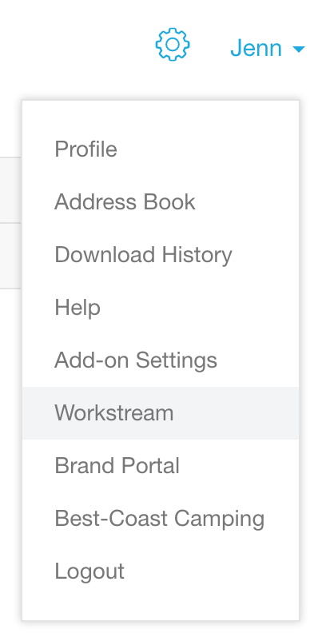
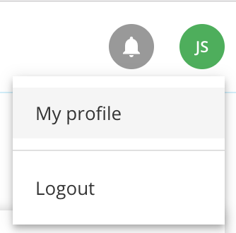
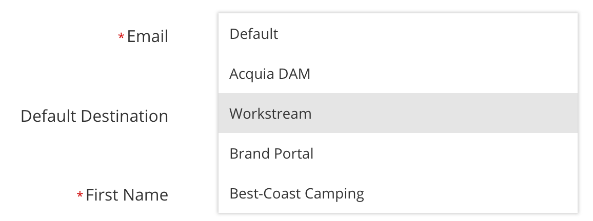
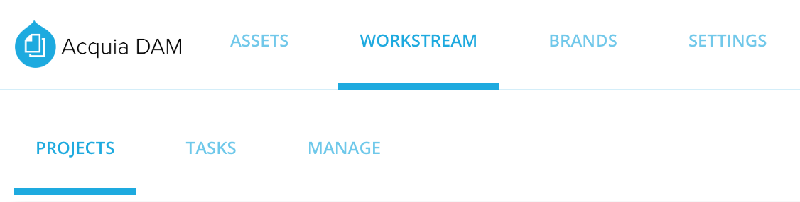

# Part 1: Accessing and Navigating Workstream

In these lessons, you will learn:

* How to access Workstream
* How to make Workstream your default view of Acquia DAM
* About Workstream’s main navigation

### 1. Accessing Workstream

We will start with accessing Workstream from the core DAM as a System Administrator. Login using your username and password.

If you find that you do not have Workstream access as a System Administrator, and expect to, please contact your Acquia Account Manager.

If you are not a System Administrator, and need DAM access, you should contact the Acquia DAM Administrator at your organization.

To access Workstream from the core DAM homepage:

* Click on your username in the upper right corner, and select Workstream 
* This will take you to the Workstream homepage

### 2. Making Workstream your Default View

If you use Workstream daily, and prefer to set it as your landing page after login:

* Click on your username in the upper right corner and choose Profile

* On the resulting page, in the Account Information section, change the default destination to Workstream

* Click Save to save the configuration
* Now, when you login to Acquia DAM, you will land on Workstream as your homepage.

### 3. Workstream’s Main Navigation

Let’s take a look at Workstream’s main navigation, so you know your way around.

#### The Projects Dashboard Tab

By default this is the first page that shows in Workstream. All projects that are currently active and in progress will appear here.

Details included in this default view are:

* Project Name
* Remaining Tasks
* Launch Date
* Percent Completion
* Assets, and
* Watchers

#### The Tasks Dashboard Tab

On this main task view you will see:

* Task Name
* Current Status
* Due Date
* Assignee
* The Project the task is assigned to, and
* Watchers

#### And finally, The Manage Tab

This tab is visible to administrators of Acquia DAM only. An administrator in Acquia DAM is automatically an administrator in Workstream.

The Manage tab includes three nested tabs:

* **Preferences**, where you will configure Workstream preferences
* **Request Forms**, where you will configure request forms your team can use for specific types of requests, and
* **Approval Paths**, where you will configure approval paths that certain asset types must follow to gain approval.

We will dig deeper into what you can do on each of these tabs in later lessons.

