# Part 2: Configuring Workstream Preferences

In these lessons, you will learn about:

* Adding groups of existing users to Workstream
* Setting asset upload preferences
* Setting proofing preferences
* Setting deadline warnings
* Setting task management and assignment preferences
* Deactivating Task status, and
* Best practices for Workstream preferences

Starting on the Manage tab in Workstream, there are specific preferences that administrators can configure.

### 4. Adding Groups of Users to Workstream

This lesson assumes you have already created user groups as part of Acquia DAM Administration Training. Essentially, you will give an existing group of users permission to log into this core piece of Acquia DAM.  These are typically team members who would assign tasks, or have tasks assigned to them. Any other user in your organization with access to the DAM will be able to submit items for approval, generate proofs, and edit from directly in the asset details window, even without direct access to Workstream.

To add groups of users to Workstream, the groups must consist of Contributors, and have been previously created in admin/user settings. If a group has been added to Acquia DAM, and you want to grant Workstream access:

* On the Preferences tab, find "Groups with access to Workstream" 
* Start typing a group name into the field for Groups with Access to Workstream \("Marketing Campaign A Contributor" in this example\)
* When the correct group name appears, select it
* Click Save changes to save the configuration.

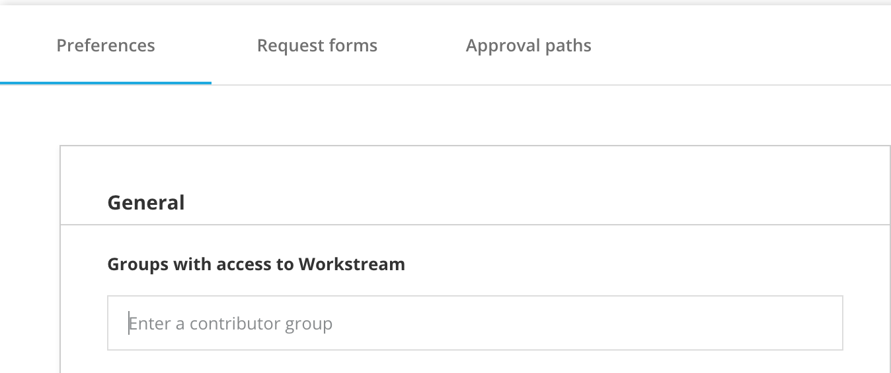

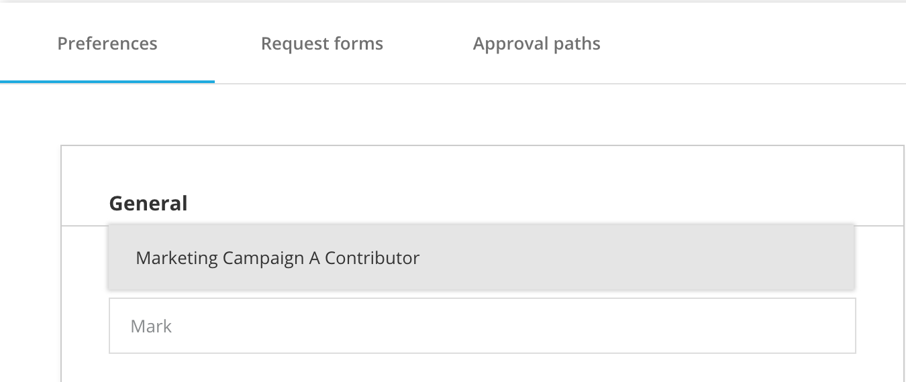

For further instructions on how to add user groups, so that you can include them in Workstream, you can review our **Introduction to Acquia DAM Administration Training \(e-learning\)**.

### 5. Setting Asset Upload Preferences

The assets section of the Preferences tab has two checkboxes that determine:

* Default approval path, and
* What happens when new assets are uploaded

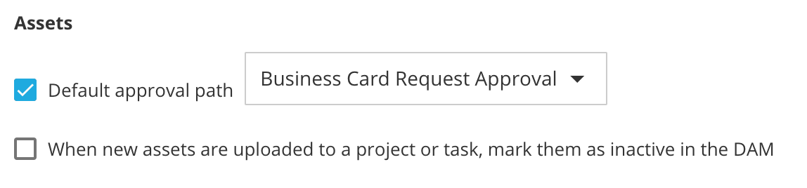

The first checkbox controls the default approval path, and allows the administrator to set the destination folder for new assets uploaded that do not live in Acquia DAM currently. If none is selected, all newly uploaded assets will go to the default folder. This folder is the default holding location before assets can be assigned to a space in the DAM.

* As soon as you purchase Workstream, a “Workstream Assets” folder is created in Acquia DAM. This is the default folder location for Workstream until you change it.
* If you want to change this configuration, click the Default Approval Path checkbox
* Select a path from the dropdown \("Business Card Request Approval" in this example\)
* Click Save changes to save the configuration

The second checkbox, “When new assets are uploaded to a project or task, mark them as inactive in the DAM” determines the type of interaction you want to allow for assets in progress.

* When assets are uploaded, there is a choice to make them inactive or active. These assets will be uploaded to the location specified in the previous step, or to the default folder if no change is made.
* As a best practice, it’s a good idea to check this box to prevent DAM users from interacting with an asset that has not necessarily been approved for use.
* As another option, you can restrict access to the entire Workstream Assets folder here in the Assets section by making it Inactive. Do this by clicking on Assets in the main navigation, and choosing the Workstream Assets folder from the folder tree on the lift of the page. Once you have selected the folder, click to edit the folder on the right side of the page and choose "Deactivate."
* Click Save changes to save the configuration

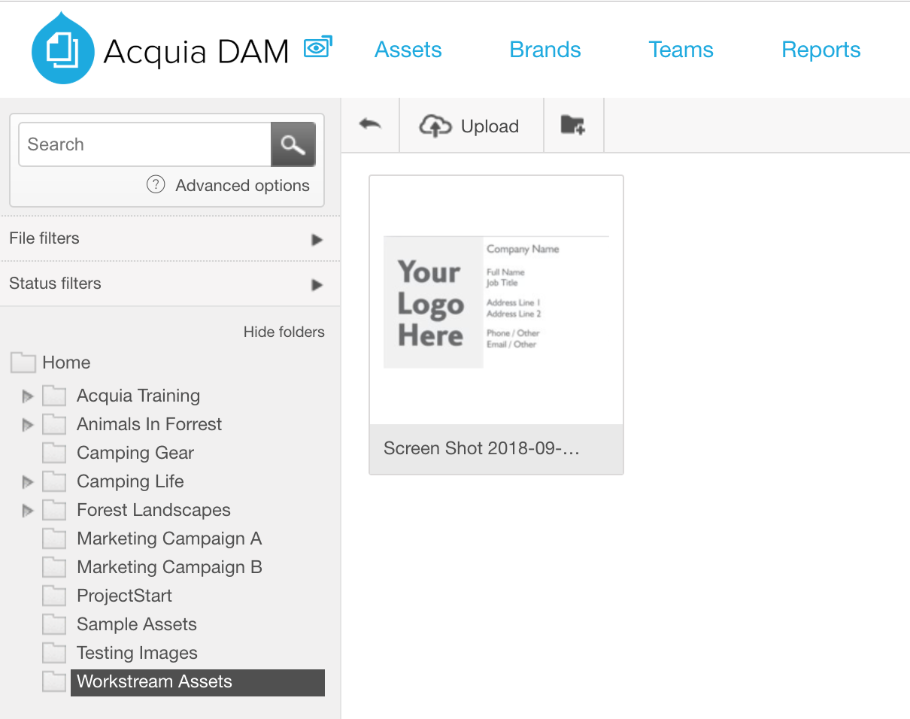

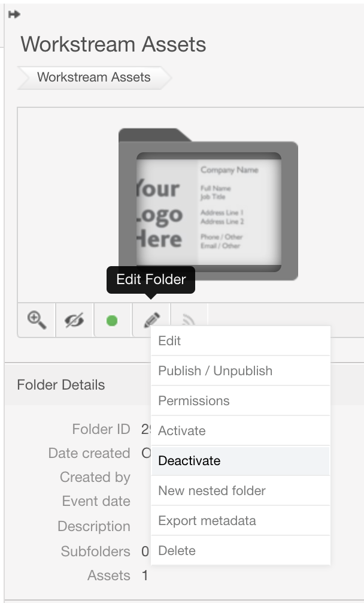

### 6. Setting Proofing Preferences

Options here are to generate a proof on asset upload or only when requested. Of note, generating proofs _only when requested_ may create delays in the approval process for large assets.

* Select the radio button that matches your preference.
* Click Save changes to save the configuration.
* Acquia recommends that if ALL assets will be going through Workstream approval, then choose the “generate upon upload” option. If less than half will be going through Workstream approval, then choose “generate proof upon request.”

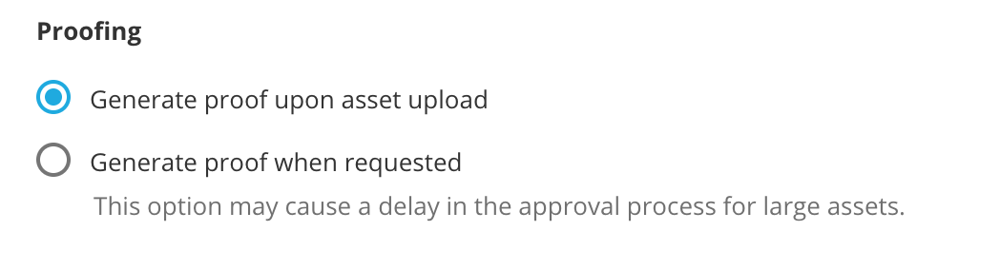

### 7. Setting Deadline Warnings

Two checkboxes allow administrators to set deadline reminders for tasks \(due dates\) and projects \(launch dates\). To set these deadline warnings:

* Click the checkbox to select it
* Select the lead-time for the deadline warning \(the numbers 1 through 10, _and_ days or weeks can be selected\)
* Click Save changes to save the configuration
* Now, each time a task or project is nearing its due date, a notification will be sent to the task or project owner, the assignee, and any watchers of this task.

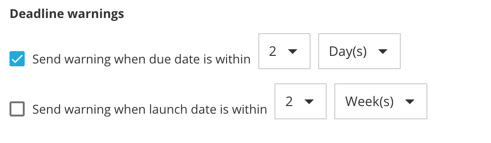

### 8. Setting Task Management and Assignment Preferences

On the right is where you will configure all of your task statuses. When a user submits a request form, that request becomes a task that gets assigned to a specific person. While tasks are moving through the workflow, status can be adjusted to keep everyone up to date on their progress. You can customize task statuses however you need to, and you can add up to 30 task statuses.

Draft is the default status for any newly created task. This task cannot be changed in Acquia DAM. As soon as a task is created, before anything happens to it, the status will be “Draft.” “Pending” status will always show up with red color. This cannot be changed either.

Let’s add a task status.

* Click on the plus sign to “Add Task status” \(You have to roll your mouse over the upper right corner of Task Status area to reveal the "+" to add a new status.\)

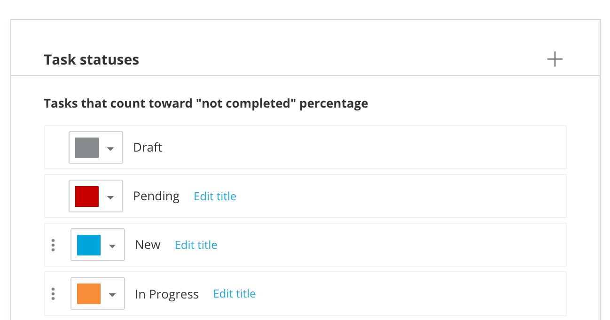

* Once the new task status has been added, select a color for it by clicking on the colored box.

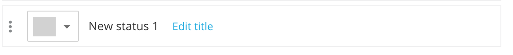

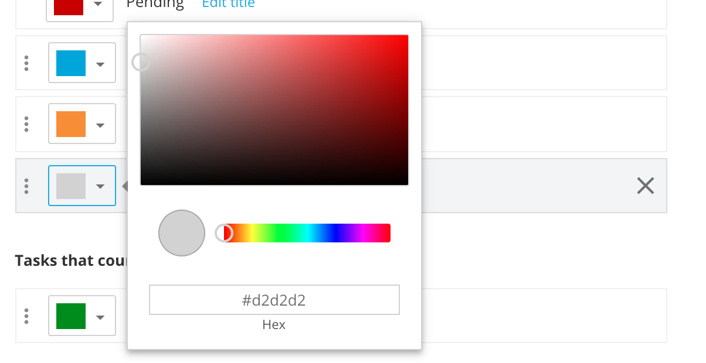

* Name the task status by clicking “Edit title” \(call it “In Review” for example\)

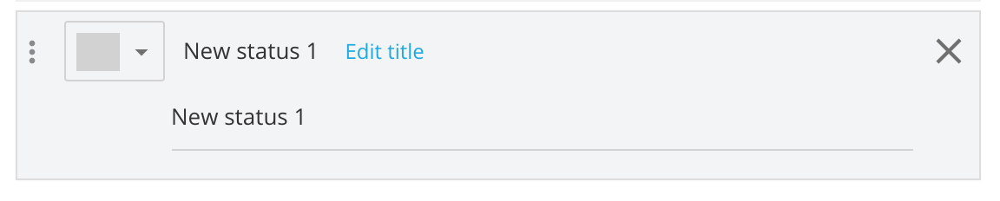

* Grab the task status and drag it up or down to the place in the status list where you want it to appear. It is important to note that the task statuses will appear in the order in which they are listed here, so if you want "In Review" to come after “In progress” as someone works their way though this task, drag it down below "In progress."

You can adjust any other task status as needed. You can change:

* The task name
* The representative color
* Whether the status is active or inactive
* The order in which the status is achieved, relative to other task statuses, and
* With a limited number of statuses, whether or not it counts toward calculating the % completion of a task

If you want a task status to count toward calculations of % completion of the task:

* Hover over the left side of the task until your cursor indicates you can pick it up
* Drag it down into the “Tasks that count toward completion percentage” page section’
* Click Save to save the configuration

### 9. Deactivating Task Status

If you create a specific status tag for a seasonal type of project that you only need during a certain time of the year, you can move that to inactive, so it will not clutter up your workspace for the rest of the year.

### 10. Best Practices in Settings Configuration

As you are configuring task statuses, consider these best practices:

* Try to start with a simple workflow using a few statuses. Add statuses as needed based on how assets are moving through the workflow, and where additional communication and coordination of related tasks and activities might be needed. In other words, start simple and make the workflow more complex only if needed.
* It is recommended that someone in the admin group serve in the role of DAM coordinator or manager, taking the lead on reviewing projects and tasks, making sure that tasks are assigned and moving forward, and especially when you are new to Acquia DAM, troubleshooting request forms and approval paths.

