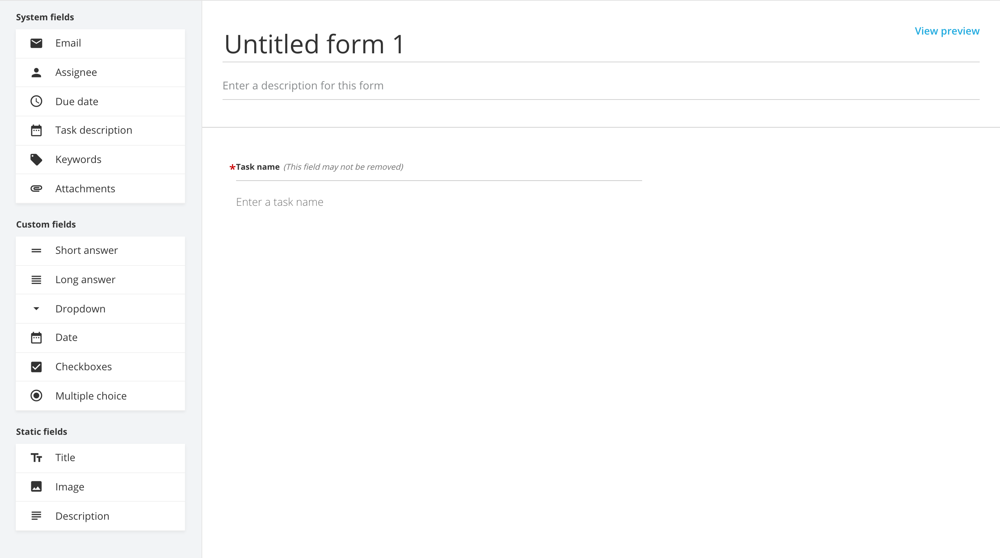
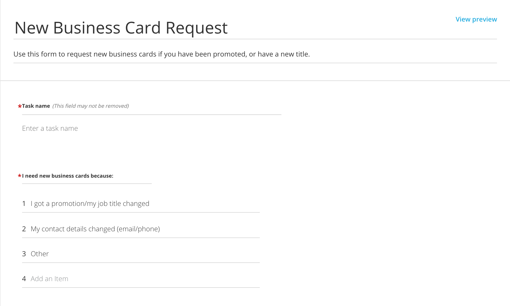
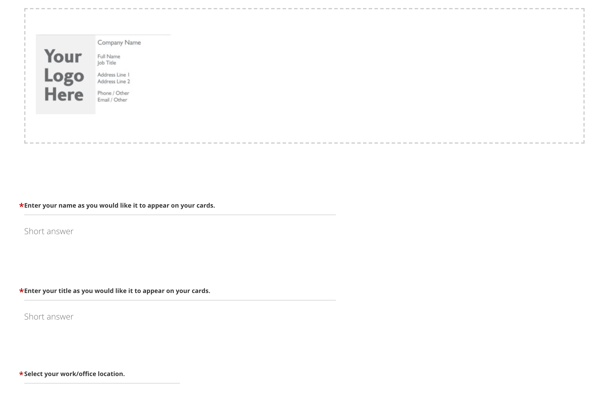
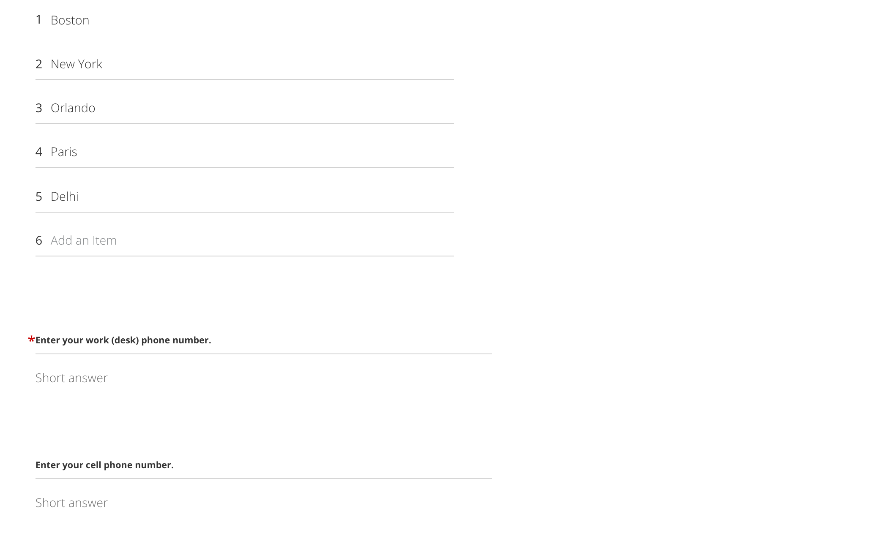
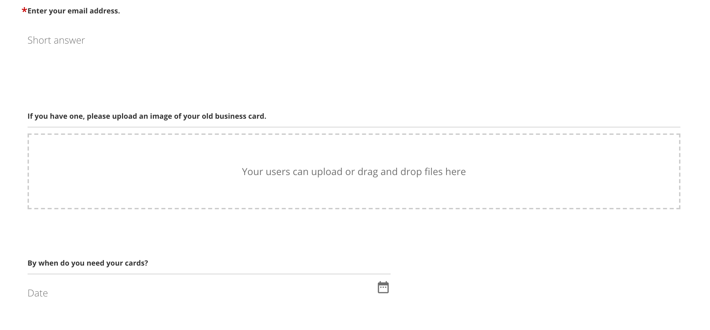
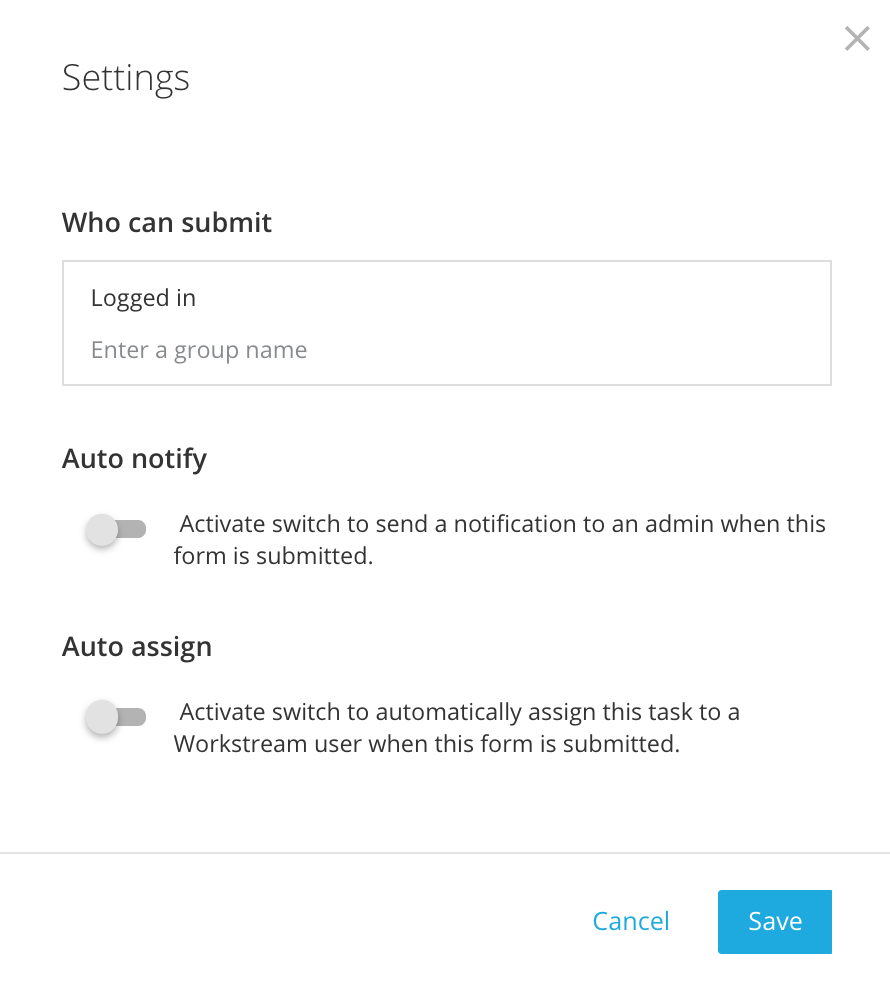
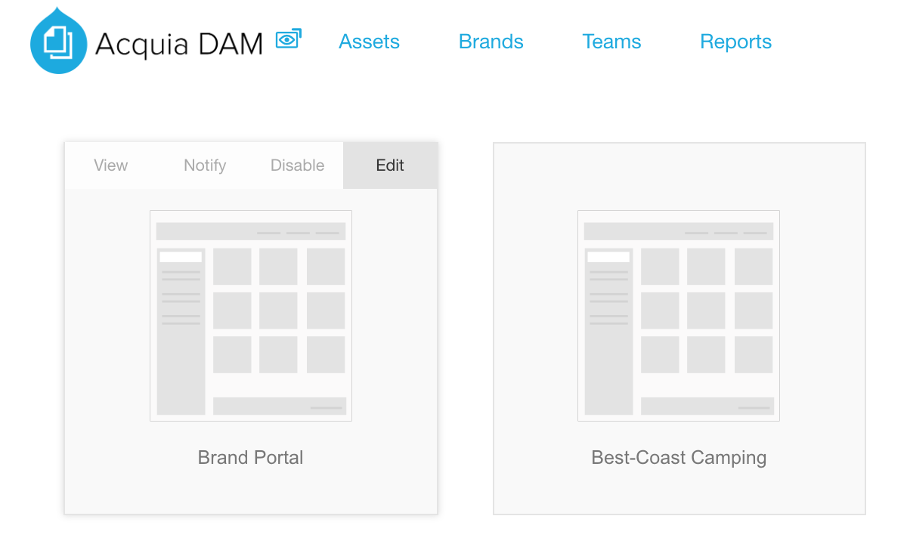
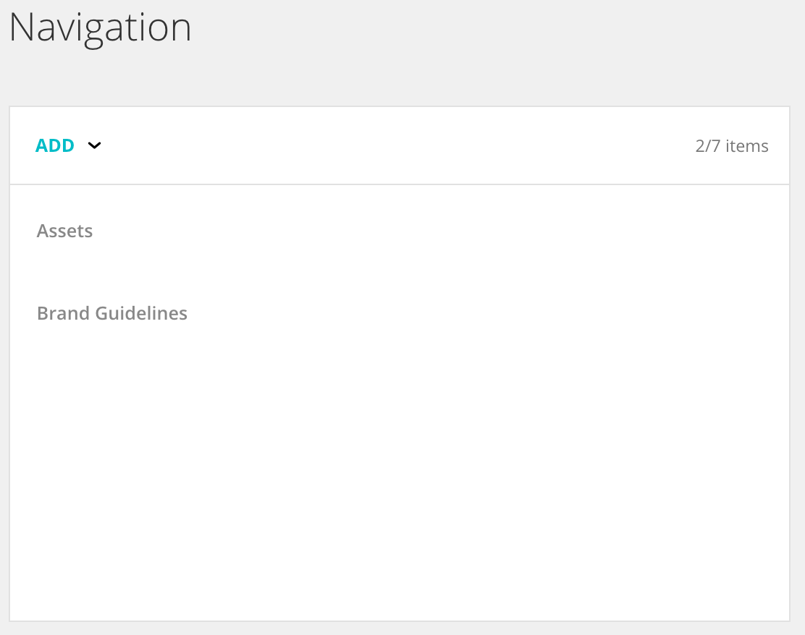

# Part 3: Creating and Managing Workstream Request Forms

In these lessons you will learn about:

* Request Forms and how you use them in Acquia DAM
* The fields and elements available to you when building Request Forms
* How to create and preview a new Request Form
* How to manage, publish, and unpublish existing Request Forms
* Request Form settings and preferences
* How to complete a Request Form
* A sample request form and how to build it
* Request Form administration best practices

Request forms are the foundation of the entire flow of work within Workstream. All work starts with a request form. Your team members complete request forms when they need something specific. Request Forms can manage any type of request whether it is a new business card, new website content, or a new cover image for a magazine. Essentially, with Request Forms, you are showing people on your team how to request things from you, and what specific information you need to process different types of requests.

### 11. Request Forms Overview

The Request Form user interface will show any forms that are published or unpublished as well as:

* Permitted users \(indicating which groups are allowed to request work using this form\)
* \# in use \(indicating the current number of open forms of this type\)
* \# of ever used \(indicating the total number of these forms ever used\)
* When last used \(showing the date the last form of this type was submitted\), and
* Completion rate \(showing the % completion of request forms of this type\)

New request forms will not be automatically published. Request forms will be kept in draft form until they are approved.

### 12. Request Form Fields and Options

All fields listed here can be used to create Request Forms.

* Drag and drop the fields necessary to build the form.
* To make a field mandatory, there is a toggle for each field once it’s added.
* To reorder, drag and drop the fields throughout the form.
* Fields can also be deleted once added to the form.

#### System Fields

Let’s review these System Fields.

* **Email:** Use this field if you want the person making the request to put in an email different than the one they’re using for Acquia DAM as the recipient of the deliverable related to the completed request.
* **Assignee\*:** Use this field _**only if you want to allow the person making the request to assign this task to a specific person**_. \(Use this field with caution, as you may want to reserve this right for administrators or managers. On assignment of the task, the assignee listed here will get an email telling them they have a task they must complete.\)
* **Due Date\*:** Use this field _**only if you want to give the requester the ability to provide the deadline for this task**_. Avoid using this field if you prefer for team managers to assign due dates as part of task review and assignment. This type of due date assignment uses a separate due date field.
* **Task Description:** Use this field to allow the requester to provide a description of the task or the requested asset.
* **Keywords:** Use this field if you want requesters to tag this request with specific keywords such as a specific campaign, product launch, etc.
* **Attachments:** Use this field if you want to allow the requestor to upload any assets or documents related to the request.

#### Custom Fields

Custom fields you can use to build Request Forms include the following:

* **Short Answer:** Use this field to include a short text field in your Request Form. Note that you need to edit the short answer label, which becomes the question or request for information the user sees in the Request Form.
* **Long Answer:** Use this field to include a long text field in your Request Form. Again, edit the answer label to indicate the question you are asking of the person making the request.
* **Dropdown:** Use this field when you want the user to select only one of a selection of multiple responses in the Request Form.
* **Date:** Use this field to allow a user to include a date in the form, related to other information in the form, or the date they would like something done, but without starting a countdown, like the use of the Due Date field.
* **Checkboxes:** Use this field when you want to allow a user to select one or more from among a list of specific responses in the Request Form.
* **Multiple Choice:** Use this field when you want to allow a user to select only one from among a list of specific responses in the Request Form.

#### Static Fields

Static fields are used to make Request Forms more visually appealing or easy to understand and use. Static fields include:

* **Title:** Use this field to add a title other than the Request Form title, or to add section headers to a longer Request Form.
* **Image:** Use this field to include an image on the Request Form.
* **Description:** Use this field when you want to include a longer, or more formatted description or text content in the Request Form.

### 13. Creating and Previewing a New Request Form

Remember, when creating new Request Forms, good candidates are common requests for creative assets and collateral within your organization that are handled via email, verbal request, ticketing system, or other means that would benefit from being managed in the central workspace of the creative team. It is a best practice to write up the process for which you are creating a request form in detail before you begin to develop your request form. 

To create a new form:

* Click on **New Form** at the top of the page.
* This will take you to the edit page for a form

* Enter a description for this Request Form
* The default task name is required. The requester will need to complete the task information at the minimum.
* Drag and drop the desired system fields, custom fields, or static fields to create the form.
* As you build the form, you can click "View preview" to see how the form will look for the requester.
* From the preview, you can click "Return to edit mode" to return to the form-builder interface.
* When finished, you can save as a draft or publish the Request Form.

**Common Forms**

* New Event signage requests
* New image requests
* New image resize requests
* What new thing do you need created \(from pick list\)
* Simple help/get in touch with Admin/catchall form \(long answer + attachments option\)

### 14. Example Request Form

Let’s take a look at a common example of a Request Form and how it was conceived: requesting a business card.

If we look at the sample form, there are fields here to capture the information the creative team member will need to know in order to complete the request.

In this form, you can see that those completing the request form: 

* Can see an example of what their business cards will look like
* Have to select their reason for new cards
* Have a field to upload their current business card for reference
* Have a field to indicate when they need the cards, which is distinct from a "due date" for the requested task.

### 

### 15. Managing Request Forms

All request forms can be edited, duplicated, or deleted. To do this, go to the main Request Form page and click on the button on the right side of the form’s row. From there the options show to edit, duplicate, or delete the Request Form.

* Select the appropriate option
* If you select Edit form, you will return to the form builder to edit the form
* If you select Duplicate form, you will return to the form builder to edit a new form with the name “\[Old Form Name\] \(Copy\)”, which you can change as needed.
* If you select Delete form, you will have to confirm your selection before the form will be deleted permanently. You cannot recover deleted forms, so use Delete form only if you intend to Delete \(and not simply un-publish\) a form.

### 16. Publishing/Un-publishing Request Forms \(including to Brand Portal\)

To publish or un-publish, there is a toggle on the left of the Request Form. Toggle this on to publish and off for draft.

If you wish to adjust a form's settings, including who can submit the form, and auto-assign and notification details: 

* Click on the form you wish to edit in the “Request Forms” tab \(Workstream → Manage → Request forms\).
* Select the form.
* At the bottom left of the form click on **Settings.**
* Adjust the settings by toggling the active button for each.
* Click **Save.**

If the Request Form needs to be published to a Brand Portal so users with Brand Portal access can use it:

* Click on the “**Brands”** tab at the top of the page \(next to Workstream\).
* Hover over the Brand Portal to which you saved your form and click **Edit**. \(This only applies if there are multiple Brand Portals created.\) If you only have one portal, click it.

* Click on **Navigation** at the top of the resulting page.
* On the resulting page, click on **Add → Workstream Requests**.

* These menu items can be customized to say whatever is desired.
* Instructions can be updated as needed from this screen as well. This screen will be different depending on which permissions the user has. An admin will be able to see all information.
* Click **Save**.

### 17. Auto-Notify and Auto-Assign Settings for Request Forms

As we saw when adding a Request Form to a Brand Portal, there are a few settings related to Request Forms that you can control as an administrator.

When adding a new Request Form:

* Click Settings
* Toggle Auto-Notify and enter the name or email address of a DAM administrator to send a notification to that person any time a new Request Form of this kind is submitted.
* Toggle Auto-Assign and enter the name or email address of a team member to send a notification to that person that this task is assigned to them any time a new Request Form of this kind is submitted.
* Click Save to save the configuration.

### 18. Filling out a Request Form

Before non-Workstream users can fill out a Request Form for this section, a form needs to be created and published to the Brand Portal.

The Brand Portal not only allows the customer to control their Brand guidelines, but if a user isn’t finding what they need, or would like to submit a request for something new, Request Forms allow Brand users to make these requests.

* To complete a Request Form, the user will click on Requests \(or whatever you have named your menu item\), choose a request form, and click Get Started, to complete it.
* The user enters content into all of the required fields, and whichever optional ones they need.
* From here, they submit the form or cancel it.
* The “Save for later” option is an option for those working in workstream, to save a form in progress. Brand Portal users will only have the Submit and Cancel options.
* On editing a Request Form - users who submitted forms cannot re-access and edit Request Forms they have submitted. Only those with administrative access to Workstream are able to edit submitted request forms.
* When completing a form that includes the Attachments field, an end user can either navigate to their computer to find the file, or, if they have DAM access, click this icon to pull from assets that already exist in the DAM. This is all permission-based, so the user will only be able to access those assets they have permission to access in the DAM.
* On form submission, it will take the user to the Requests page again, so they can submit another request form if needed.
* As an admin, if you go to the task dashboard view, you can see that the task has now been created. You will see:
  * The Task ID \#. Every project and task gets an ID \# associated with it.
  * The task description from the requester.
  * The Pending status of this task \(for now, since it was just created\). It will appear as Pending/RED until it is assigned.
  * It’s due date \(if one was assigned\)
  * It’s project \(if one was assigned\)
  * It’s watchers \(if any were assigned\).
  * You can change the task status, change the assignee of this task, or move the task to a project on this screen, by using the "more options" menu, and selecting your choice. A dialog box will appear in which you can add details or make a selection.
  * If you choose Duplicate task from this more options menu, it will immediately duplicate the task, and put you on the detailed task view.

We will cover Task management in more depth in a later lesson.

### 19. Best Practices in Request Form management

Here are some tips and best practices when working with Acquia DAM and Request Forms:

* Look at Request Form “Ever Used” vs. “Completion Rate” statistics on the Request Form tab. If the Completion rate is low, look at your form for possible causes.
* On the Request Form tab, you can sort the view by its headings to see the most or least used Request Forms, view forms by completion percentage, by most open forms, or other facets.
* In the same way that you have permission folders, you can permission out a lot of different pieces in Workstream as well. Some companies set up certain request forms that are available to users of Workstream, and others that are available to users outside of Workstream. External users need less complex tasks completed \(I need these pictures, or I need this resized\), whereas creative users will have tasks that are more like creative briefs, that are available to those creative users.
* For Request Forms that are for internal marketing team members, you may want to include the Assignee and/or Due Date fields, if the people making requests would know that information.

